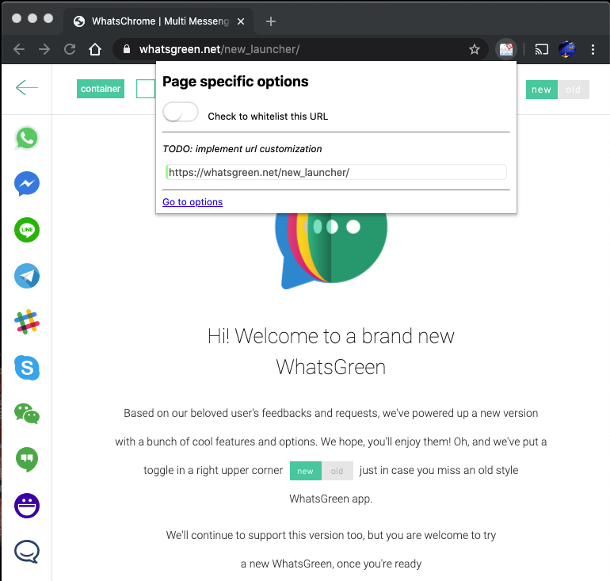
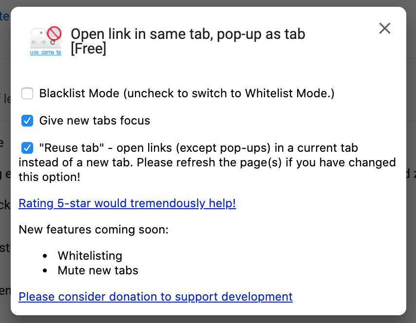
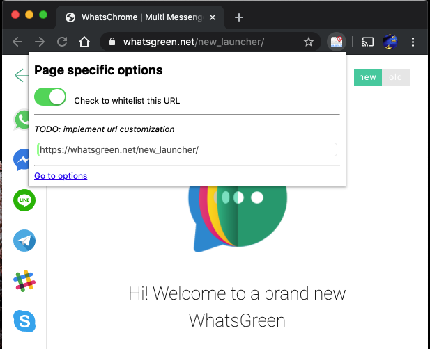
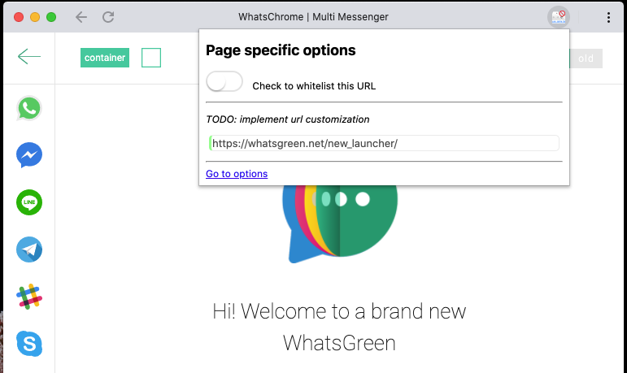

# Disclaimer

This addon is taken from dev@sergiy.net at
https://chrome.google.com/webstore/detail/open-link-in-same-tab-pop/jmphljmgnagblkombahigniilhnbadca

I modified it because some Multimessenger Addons don't load from a "chrome://extensions/" URL anymore. As result they where captured by the original plugin and converted to a Tab.

This causes the messengers to lose the ability to create their own taskbar icon for faster and easier access.

## Github
_Because I coudn't find a public github repository of the original extension, to file a merge request, i created a new one._

# Usage

The updated version is able to switch between blacklist and whitelist mode.

## Blacklist Mode

The default setting is the blacklist mode. All Popups are converted to Tabs.

If you want to disable that behavior disable the switch on that specific site.

* 

## Whitelist Mode

You can use the options to switch to the whitelist mode.
* 

All new popups are untouched until specifically enabled.
* 

Page whitelisted
* 

## Missing Features

The white/black listing only works with the target URL. Not the URL of the page which opens the new popup window.

### Example

Page www.foo.com/popup.html opens a new window with the url www.foo.com/bar.html

Switchting options at www.foo.com/popup.html will not result in changing the behavior of www.foo.com/bar.html

You need to toggel settings at www.foo.com/bar.html to have the desired effect.

# Contributions welcome